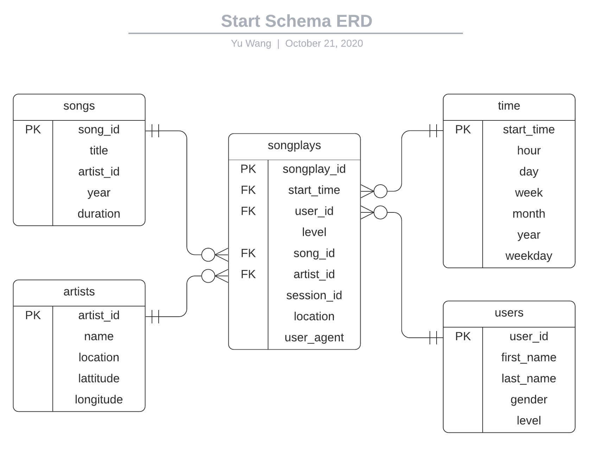
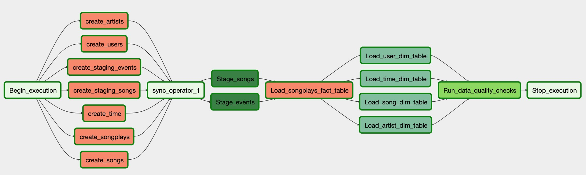

# Data Engineer Nanodegree Subproject
The repository contains the project information of the **Data pipeline with Apache Airflow** from Udacity Nanodegree 
**[Data Engineer](https://www.udacity.com/course/data-engineer-nanodegree--nd027)**. Please refer to the 
course [website](https://www.udacity.com/course/data-engineer-nanodegree--nd027) for more details. 

Project scenario: A startup called Sparkify wants to automate and monitor their data warehousing ETL on AWS. They have decided to use 
Apache Airflow to do the job. They have their original data resides in AWS S3 including user activity logs and song metadata in *JSON* format. 

Database schema/tables and most of the ETL are already provided, the main task of this project is to use Apache Airflow to automate the ETL and 
monitor the pipeline using Airflow UI.

## Business Process / Data Requirements
Data engineering team already have an ETL process and want to automate and monitor the ETL with Airflow, details about the ETL:
- Analytics team need to understand **what songs** their **users** are listening to by analyzing a set of dimensional/fact tables.
- Analytics team wants to build a **Data Warehouse on AWS Redshift** with tables designed to **perform analytical queries** and gain insights on song plays.

## Engineering Task
- Create and launch a AWS Redshift cluster
- Move existing ETL to AWS and automate/monitor the ETL with Airflow

## Tools Used
- Python 3
- [AWS](https://aws.amazon.com/)
- [Redshift SQL](https://docs.aws.amazon.com/redshift/latest/dg/welcome.html)
- [Apache Airflow](https://airflow.apache.org/docs/stable/)
- [LucidChart](https://www.lucidchart.com/)

## Original Data Sources
**Note** that the actual data (in *JSON*) used in this project is a subset of original dataset preprocessed by the course. The provided data 
resides in AWS S3 (publically available).
1. Song data from [Million Song Dataset](http://millionsongdataset.com/)
2. User activity data from [Event Simulator](https://github.com/Interana/eventsim) based on [Million Song Dataset](http://millionsongdataset.com/)

## Database Schema (Data Warehousing) Design
The schema is already provided for this project. A bit more explanation of the business process: 
Since the core business process/metric is an user playing a song, the fact table should store the song play records with 
user/song identifier together with related information about the how and where the song is played. Based on the data and tables 
given in the project, the star schema looks like this (generated using [LucidChart](https://www.lucidchart.com/)):

## ETL Process (defined and visualised via Airflow DAG)
The DAG:

## Code Usage

Copy the files in respective folders for your own Airflow installation and execute the DAG.

## Some notes regarding the DAG
1. The DAG will handle the creation of tables (only create tables if they don't exist)
2. A sync-node to make sure tables are created before further operations in the DAG
3. Need to set ``catchup = True`` and set ``schedule_interval = '@hourly'`` since we only have data from 2018/11
4. Staging tables will be truncated before loading by default, however the user can opt to append the table
5. Fact tables will not be truncated before insert by default, however the user can opt to trancate the table first
6. Dimension tables will be truncated before insert by default, however the user can opt to append the table
7. Data quality operator will check for number of records and ``NULL`` values